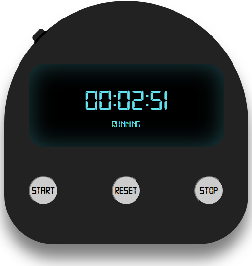

## Para que serve isso: 

Esse foi apenas um exercício de Javascript onde o objetivo recriar um cronometro utilizando HTML5, CSS3 e Javascript.

  
Link para o JSFiddle: https://jsfiddle.net/praytokuro/8fwo2hy1/4/
